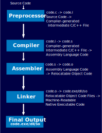
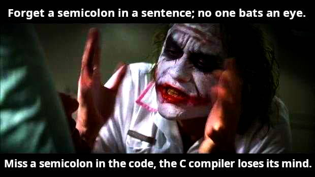
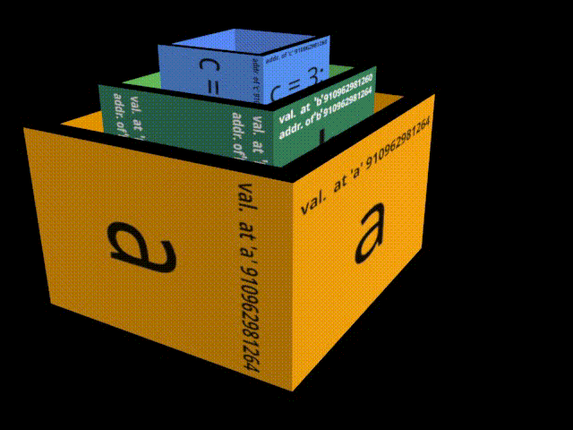
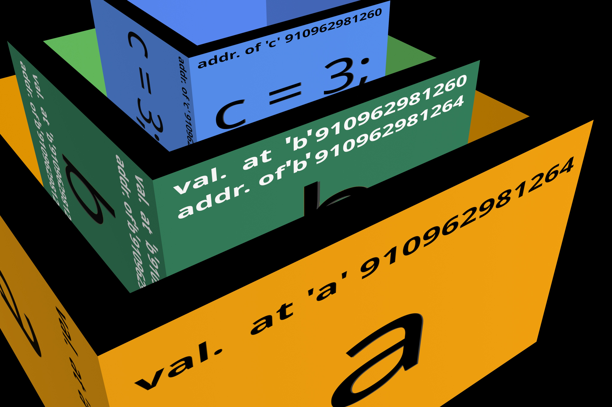

```
   ___ _ __ _   _ ___| |_
  / __| '__| | | / __| __|
 | (__| |  | |_| \__ \ |_
  \___|_|   \__,_|___/\__|
```

'crust' - Learn the basics of Rust and C side by side.

Here, I'll document my hurdles in learning Rust and utilise whatever knowledge I have in C. This repository must not be treated as a base for the upcoming publication of a top-selling ePub for the Rust programming language. As of today, 2022/10/14, the tutorial 'crust' is in its early stages. It is expected that 'crust' will undergo perennial refinements.
I'll try to keep things as simple as possible so that anyone within the age group 10 to 15 can learn elementary-level Rust and C. Adults should also find the tutorial easier than the programming books recommended in their high school/pre-university curriculum. Things are expected to be short since I may have to look back. If possible, the learning sessions will be translated into the Bengali language. Auto-translation software will be used to translate the documents into Bengali. Grammar-checking services will be used occasionally in the English versions. Please create a pull request in the GIT branch 'rough' if you want to improve the learning experience or if you have a suggestion.

Your active participation might help hundreds of newcomers to learn the concept of coding. The flow of logic and algorithms are almost the same across programming languages. I want you to participate. I'm not interested in any indirect involvement.

Don't expect any long introduction, since I don't have time for that. I have to keep things short. Don't expect eBooks in ePub or HTML format at the moment. However, an auto-generated HTML version of the documents will be provided from time to time.

# Setting up the Toolchains and IDEs

Please have a look at [Tulu-C-IDE](https://github.com/Pinaki82/Tulu-C-IDE).

You will find instructions to set up the [MSYS2](https://www.msys2.org/) Build Environment in detail. Leave the Installation directory up to the [MSYS2](https://www.msys2.org/) installer (The default location is: `C:\msys64`).  For consistency, we won't be using the "Microsoft Visual Studio Build Tools" (a.k.a., [Windows SDK](https://developer.microsoft.com/en-us/windows/downloads/windows-sdk/)) or the IDE version of the MSVC (a.k.a., [Visual Studio](https://visualstudio.microsoft.com/)). If you want to install MSVC, go ahead and do so. Examples provided here will compile either with MinGW (a variant of GCC that you can find in the MSYS2 repository) or MSVC. However, you're on your own if you choose MSVC; make sure you set up the Microsoft build environment properly through the Microsoft-provided `vcvarsall.bat`.

I do not recommend a full-blown IDE like Visual Studio, QT Creator, KDevelop, Code::Blocks IDE, CodeLite IDE, or Eclipse CDT unless you have very specific requirements to run a particular IDE. You won't need any of them, at least for now.

To keep things simple and make the journey a hands-on experience, do not use the autocompletion feature in any of the editors mentioned. However, you are allowed to use those editors mentioned with their configurations ([Tulu-C-IDE](https://github.com/Pinaki82/Tulu-C-IDE) and [Tulu-C-IDE Helix Edition](https://github.com/Pinaki82/Tulu-C-IDE/tree/main/_helix_edition)). You can look at the autocompletion hints, but type the code yourself. In my opinion [Tulu-C-IDE Helix Edition](https://github.com/Pinaki82/Tulu-C-IDE/tree/main/_helix_edition) will be a better choice for learning. Type the codes yourself. Or else, you'll learn nothing. I mean, be a little honest with yourself. Don't cheat yourself.

The more you will type the code yourself, the less you'll forget what you've learned. If you are on MS Windows, try [Geany](https://www.geany.org/download/releases/) or [Notepad++](https://notepad-plus-plus.org/downloads/). On Linux systems with GTK-dependent Desktop Environments, such as GNOME, XFCE, MATE, Cinamon etc., you can use Geany. If you are using a Linux distribution that ships a QT-based Desktop Environment, for example, KDE, LXQT etc., try [Kate](https://kate-editor.org/en-gb/get-it/). Like [Geany](https://www.geany.org/download/releases/), [Kate](https://kate-editor.org/en-gb/get-it/) can be installed on MS Windows.

[Kate](https://kate-editor.org/en-gb/get-it/) comes with built-in LSP support. Thus, if [Kate](https://kate-editor.org/en-gb/get-it/) finds the two files `.ccls` and `compile_flags.txt`, you'll see autocompletion hints. So, beware and don't use autocompletion. Autocompletion is useful when you have some familiarity with the language, not at the time of learning. Nevertheless, [Kate](https://kate-editor.org/en-gb/get-it/) is also a text editor of choice among professionals and serious hobbyists for code editing. It works like a charm on my MS Windows 10 machine, my primary (work) computer.

# Build & Run

Download the entire repository in a Zip archive. Extract the zipped file somewhere on your hard drive. Remember that the location (path to the directory where you want to extract the archive) must not contain any space or special character other than underscores (i.e., `_`). Examples: `G:\test_n_practice\crust`, `/home/YOUR_USERNAME/crust/`.

# Our Strategy

Enter `crust/` from the graphical file manager. R-Click inside the folder and find the option to open a terminal emulator there. Open two terminal emulators if you are on Linux, one for editing the source file with Helix and the other for compiling/executing the code. Type `ls` (Linux) or `dir` (Windows) to see the contents of the folder. You'll find `runc.sh` that you can use on most Linux systems to build/run the code. Use `runc.BAT` or `runc-msys2x64.sh` on MS Windows machines. You don't have to open a separate console. Double-click on the DOSBATCH script and it will take care of the build process. Or, use the script `runc-msys2x64.sh` with the "MSYS2 MinGW 64-bit" Bash Shell.

```shell
# Change the execution permission parameter of the script.
chmod +x runc.sh
# Run the script.
./runc.sh
```

**Modify the files `main.c` and `main.rs` in `crust/code/testbed/src/` along the way**. You'll keep backups in a plain text file.

Find a file `exercises.txt`. After learning a particular topic, write the code and notes to `exercises.txt` on the topic you covered.

**FAQ**: Can I use the Power Shell? Yes, but it doesn't have any purpose here. Build chains are largely driven by makefile generators (CMake, Bakefile), make utilities (make, nmake, mingw32-make), and build environments (Cargo), regardless of the complexity of the project. Both theoretically and technically, any console interface can be used. Although, using the PS might involve unnecessary work sometimes. Look at [this](https://stackoverflow.com/questions/69305821/compile-c-programs-from-windows-powershell-with-msvc) Stack Overflow thread. Instead, use an emulator like WezTerm and switch to the PS from there when required. For compiling C/C++/Rust projects, the more feature-rich, objected-oriented Power Shell language is not a requirement. The right tool for the right job matters the most without drifting away from the task at hand.

## Table of Contents

- [Hello, World! The Skeleton and its Anatomy](#hello-world-the-skeleton-and-its-anatomy)
  - [Comments](#comments)
  - [Code Blocks](#code-blocks)
  - [The main() Function](#the-main-function)
  - [Include Directives](#include-directives)
  - [Functions](#functions)
  - [Macros](#macros)
    - [The way the compiler works:](#the-way-the-compiler-works)
  - [Statements and the Statement Terminator](#statements-and-the-statement-terminator)
- [Receiving Inputs](#receiving-inputs)
- [The Character Set](#the-character-set)
- [Reserved Keywords](#reserved-keywords)
- [Constants, Variables, and Keywords](#constants-variables-and-keywords)
  - [Constants](#constants)
  - [Rules and Conventions for Declaring Constants](#rules-and-conventions-for-declaring-constants)
- [Data Types and Variables](#data-types-and-variables)
- [Data Types](#data-types)
- [Variables](#variables)
- [Constants](#constants)
- [Characters and Strings](#characters-and-strings)
- [Operators](#operators)
  - [Arithmetic Operators](#arithmetic-operators)
  - [Relational Operators](#relational-operators)
  - [Logical Operators](#logical-operators)
  - [Rust's Bitwise Operators & Operations On Bits in C](#rusts-bitwise-operators--operations-on-bits-in-c)
- [Rules for Constructing Instructions](#rules-for-constructing-instructions)
- [Decision Control](#decision-control)
- [Loops & Flow control](#loops--flow-control)
- [Case Control](#case-control)
- [A Brief Description of Pointers (C) and Slices (Rust)](#a-brief-description-of-pointers-c-and-slices-rust)
- [Functions and Pointers](#functions-and-pointers)
  - [Recursion](#recursion)
- [Tuple - A Rust-Specific Compound Data Type](#tuple---a-rust-specific-compound-data-type)
- [Array](#array)
- [More on Arrays, Tuples, and Vectors](#more-on-arrays-tuples-and-vectors)
- [Strings and Vectors](#strings-and-vectors)
- [The Preprocessor in C](#the-preprocessor-in-c)
- [Ownership and Borrowing in Rust](#ownership-and-borrowing-in-rust)
- [Ownership](#ownership)
- [Borrowing](#borrowing)
- [Structures](#structures)
- [Unions](#unions)
- [Enums](#enums)
- [Modules](#modules)
- [Collections in Rust and The C Standard Library](#collections-in-rust-and-the-c-standard-library)
- [Error Handling in Rust](#error-handling-in-rust)
- [Rust's Generic Data Types](#rusts-generic-data-types)
- [Console Input and Output](#console-input-and-output)
- [Operation on Files (Input/Output)](#operation-on-files-inputoutput)
- [Type Inference and Type Casting](#type-inference-and-type-casting)
- [Renaming Data Types and Typedefs](#renaming-data-types-and-typedefs)
- [Typecasting](#typecasting)
- [Bit Fields](#bit-fields)
- [Pointers to Functions](#pointers-to-functions)
- [Functions Returning Pointers](#functions-returning-pointers)
- [Functions with Variable Number of Arguments](#functions-with-variable-number-of-arguments)
- [Unions](#unions-1)
- [Union of Structures](#union-of-structures)
- [Package Manager](#package-manager)
- [Iterator and Closure](#iterator-and-closure)
- [Smart Pointers](#smart-pointers)
- [Concurrency](#concurrency)
- [fork(), exec(), pthreads(), Multithreaded Programming](#fork-exec-pthreads-multithreaded-programming)
- [Copyright Notice:](#copyright-notice)
  - [MIT-0 (The MIT No Attribution license):](#mit-0-the-mit-no-attribution-license)

# Hello, World! The Skeleton and its Anatomy

C:

```c
#include <stdio.h> // Inclusion of header files.
#include <stdlib.h>
#include <string.h>
#include <math.h>

// This is how we write a single-line comment.

/* This line is also a single-line comment. */

/*
   This is
   a
   multi-line
   comment
*/

int main(int argc, char *argv[]) { // The compulsory main() function.
  printf("Hello, C!\n"); /* printf(),
  a function that outputs formatted strings to the console. */
} // End of the code block (here, the block is the function main()).
```

Rust:

```rust
// Notice that you don't need to include a header file.
fn main() { // main() is a compulsory function even in Rust.
    println!("Hello, world!"); /* println!() is a macro
                      which is used to send formatted strings
                      to the console.
                      Notice that this line is also
                      a multi-line comment.
                    */
} // End of the code block (here, the block is the function main()).
```

## Comments

Comments are areas of code ignored by the compiler.

One who writes the code keeps pieces of information under comments as hints for what the code does in a specific section so that the logic of the code becomes easier to understand and stays maintainable in the future.

Comments in both C and Rust are enclosed within `/* */`. Another style of writing a single-line comment is to write `//` before writing the comment. `// Single-line Comment`. Anything after the `//` part is ignored by the compiler. Usually, `// comments` are used as End Of The Line Comments or simply 'Line Comments'. We use `//` where we don't need to write any code after the comment part. Whereas, `/* */` can be used as inline comments, e.g.,

```rust
fn /* comment */ main() {

}
```

```rust
// Line comments which go to the end of the line.
```

```rust
/* Single-line/Multi-line/Inline comment */
```

```rust
fn main() { //main() is a compulsory function even in Rust (a comment indeed).


    // ...
    // ...
}
```

Multi-line Comments or Single-line/Multi-line/Inline/Universal Comments:

Comments enclosed within `/* */` can be split across lines.

```rust
/*
   This is
   a
   multi-line
   comment
*/
```

Doc comments in Rust:
Doc comments are parsed into HTML library documentation:

```rust
    /// Generate library docs for the following section.
    //! Generate library docs for the enclosing section.
```

We will restrict ourselves to 1) End Of The Line Comments, `//` and 2) Multi-line/Universal Comments, `/* */`.

## Code Blocks:

A block of code or Code Block is a lexical structure of instructions grouped together comprising declarations, operators, and statements. Foxed?

Don't be! For now, remember that a code block is something grouped within brackets, e.g., `{}`.

```rust
{ // an example of the start of a block of code

} // an example of the end of a block of code
```

Simply,

```rust
{
}
```

In our Rust Hello World example,

```rust
fn main () {
 // ...
 // ...
}
```

Here, the function `main()` keeps its set of instructions within a block of second brackets `{}`.

## The main() Function:

In C & Rust, `main()` is the driving force of all programs. Every program that executes must have a `main()` function that initialises the program execution.

All major programs you run on your machine are compiled from several source files. Each source file may contain thousands of lines of code. However, the function `main()` initialises the program execution. `main()` serves as an Entry Point to the program's startup.

The `main()` appears only once, no matter how large the project is. In case you are isolating parts of the program into multiple shared libraries (*.dll or *.so), each shared library can be driven by its individual driving function `DllMain()`. On the other hand, it is not mandatory to create a DLL Entry Point for creating a shared library. We will cover the creation and use of Shared Libraries and Static Libraries in C later.

```c
#include <windows.h>

BOOL WINAPI DllMain(
    HINSTANCE hinstDLL,  // handle to DLL module
    DWORD fdwReason,     // reason for calling function
    LPVOID lpvReserved )  // reserved
{
  // Example code for a DLL Entry Point function.
  // Look here for more info:
  // https://learn.microsoft.com/en-us/windows/win32/dlls/dllmain
}
```

For now, remember that every program you write needs a `main()` function.

## Include Directives:

`#include <stdio.h>` includes a text file `stdio.h` containing some routines, such as text input/output to the console. It (`stdio.h`) is basically a plaintext source file. `#include <>` is used to attach source codes. It is called the Include Directive in C. The Include Directive is also a **macro**. We will visit the section of macros later. We will have to revisit it quite a few times.

What does the file `stdio.h` do here, should be our question at the moment. It contains routines for text input/output to the console and some other routines. Compiler writers supply pre-defined routines prescribed by the ISO C standardisation committee for common tasks. Libraries outside the Standard C Library are also used for special purposes, such as Graphics, image/video processing, Graphical User Interface, dealing with intricate mathematical problems, scientific/business application programming etc. In our Hello World example in C, we used the pre-defined function `printf()` for text output to the console.

Notice that we didn't include any standard library header like `stdio.h` in our Rust Hello World program.

## Functions:

Functions are called the building blocks of programs. A function contains a set of routines to accomplish a particular task. Think of a car assembly line where every section plays different roles, and those who work in each department in the assembly line take their own part, making each department a complete set but also an independent part of the entire workforce. Think of functions as departments in that assembly line. Functions can also be compared to Bricks that are used in construction works. Your room contains hundreds of bricks.

The function `pow(x,y)` returns `x` raised to the power of `y` i.e. `x^y` (`x` to the power `y`). `pow()` is declared and defined in the C standard library `math.h`.

We included `stdio.h` to call the function `printf()`. It is used here for sending text output to the console.

## Macros:

**MACRO**: The Search-n-Replace utility in the compilers.

To be precise, 'Macros' are a group of characters to be replaced by the compiler with another predefined set of characters at the stage known as 'Preprocessor'. Macros and Preprocessors will be discussed later.

```c
#define ADD_TWO_NUM (a, b) (a) + (b)
```

```c
#defile MAX_VALUE 1000
```

Macros in C always start with the symbol `#`.

```c
ADD_TWO_NUM(a, b) (a) + (b)
```

```c
ADD_TWO_NUM(8, 3)
```

```c
#include <stdio.h>

#define ADD_TWO_NUM(a, b) (a) + (b)

int main() {
  int u = 2;
  int v = 3;
  printf("%d\n", ADD_TWO_NUM(u, v));
  return 0;
}
```

```
gcc test.c -o test.exe
```

```
test.exe
```

```
5
```

**How macros get expanded:**

```
gcc -save-temps -c test.c
```

```
gcc -E test.c > test.i
```

`test.i`

```c
# 5 "test.c"
int main() {
  int u = 2;
  int v = 3;
  printf("%d\n", (u) + (v));
  return 0;
}
```

Look how the macro `ADD_TWO_NUM(a, b)` got expanded to `(u) + (v)`. Somewhat similar to a search-n-replace utility!

---

### The way the compiler works:

**The Four Stages of Compilation in C:**

Compilation:
Compile is a process of transforming source codes into machine language that computers speak. The process of compilation passes through four stages.

1) Preprocessor (Compiler-generated Intermediate C/C++ File, `test.c`->`test.i`.)

2) Compiler (Assembly Language Code, `test.i`->`test.s`.)

3) Assembler (Assembly Language Code to Relocatable Object Code, `test.s`->`test.o`.)

4) Linker (All Relocatable Object Code Files to Machine-Readable Native Executable Code, `test.o`->`test.exe`.)



**Compilers' primary job:** A Compiler is a program/piece of software/utility/application that turns source codes into machine-native binary executable files.

Extra Features: Beside performing designated task of translating source codes into machine native executable files, compilers may provide other facilities such as error checking, detection of runtime error, memory leak detection, Language Server Protocol for autocompletion etc.

**Stage 1 (Preprocessor):**

```
gcc -E code.c > code.i
```

In this stage, the compiler toolchain performs the following tasks:

1. Comment stripping: The compiler toolchain strips all comments and replaces them with single spaces.

2. Header inclusion and producing text blobs: The compiler toolchain attaches (includes (`#include< >`)) the instructions written in the header files (`*.h`) and creates a single blob of text.

3. Macro expansion: The compiler toolchain expands predefined macros.

Here, in this stage, the compiler takes all source files and generates individual intermediate text blobs (`*.i`). Those blobs contain routines declared in header files attached to your source codes using the include directive `#include < >`.

**Stage 2 (Compiler):**

```
gcc -S code.c > code.s
```

In this stage, the compiler toolchain transforms the preprocessed text blobs (`*.i`) into Assembly Language codes (`*.s`).

**Stage 3 (Assembler) :**

```
gcc -S code.c > code.o
```

Now the toolchain translates the assembly language codes into relocatable object codes (`test.o`) that are still needed to be resolved by the linker. Relocatable Object Code files are not human-readable.

**Stage 4 (Linker):**

```
gcc code.c
```

In this stage, a separate program (in GCC/MSVC) in the toolchain called "Linker" takes all the Relocatable Object Code (`*.o`) files and semi-compiled routines (functions etc.) from externally linked static/dynamic libraries (GUI, Graphic, Image Processing, Compression, Cryptography etc.). The linker must be told to search for those semi-compiled external files from specific locations along with the names of the libraries to be linked. We will come to Static and Dynamic Libraries later.

**A brief overview:**

**Preprocessor Stage:** For example, if your project contains three source files `one.c`, `two.c`, `three.c`, the compiler will first generate `one.i`, `two.i`, `three.i`. **Assembler Stage:** The compilation process will now pass through the Assembler which will translate the raw C codes (intermediate files, `*.i`) into Assembly Language code files. Namely, `*.s`. **Compiler Stage:** Then, those intermediate files will be converted to relocatable object code files `one.o`, `two.o`, `three.o`. **Linker Stage:** In the next stage, the compiler will search for object code files (semi-compiled) libraries you used in your project. By combining all relocatable object code files the compiler will produce a final executable file.

If you've set up your project to split the program into separate Shared Library files and executable files, then the final rendition will contain Shared Libraries and executable files.

Rust however works in a slightly different manner.

## [What does the Rust compiler do to your code](https://rustc-dev-guide.rust-lang.org/overview.html#what-the-compiler-does-to-your-code):

1) Invocation:

2) Lexing and Parsing:

3) High-Level Intermediate Representation (HIR) Lowering:

4) Mid-level Intermediate Representation (MIR) Lowering:

5) Code Generation:

[Citation needed.]

**Invocation:** First, the Rust compiler (`rustc`) is invoked by Cargo or directly by the user. The toolchain processes command-line options for optimisations and other tasks, such as installing the program after completing the build process. In this stage, `rustc` performs `check`-only builds (rather than producing executable machine code) with the help of `rustc_driver`.

**Lexing and parsing:** The raw Rust source text is analysed by a low-level **lexer**. The **lexer** turns the source code into a stream of atomic code units which are called **tokens**. `rustc_parse` takes the charge of passing the stream of **tokens** through a higher-level lexer. Macros get expanded. A set of validations is checked by the **StringReader Struct** and turn strings into **interned symbols** (Not our business. It is a way of storing only one immutable copy of each distinct string value). The parser translates the stream of tokens from the lexer output into an **Abstract Syntax Tree** (AST). Some intermediate files are generated that can be found in the `rustc_parse` directory. For example,

```
expr.rs
pat.rs
ty.rs
stmt.rs
```

**High-Level Intermediate Representation (HIR) Lowering:** The Rust compiler collects the AST. The AST is converted to a more compiler-friendly representation called High-Level Intermediate Representation (HIR). The process of translating AST to HIR is called "lowering". We will learn the types of variables in C and Rust. In short, a variable type is like a unknown quantity in regular mathematics, x,y,z,u,v,r etc., except, the variable type must be declared to inform the compiler beforehand. A variable can be of an integer type (1, 5, 99, 1567, etc.), floating value (2.05, 7.01, 39459.04567 etc.), or a string of characters (Abracadabra, Smiley emoji, Your Name, a, b, c, d etc.). Other variable types also exists. Now, the compiler uses the HIR to do type inference. Type interface is the process of automatic detection of the type of an expression. A few more tasks are performed, like trait solving, and type checking.

**Mid-level Intermediate Representation (MIR) Lowering:** The compiler now translates the HIR to Mid-level Intermediate Representation (MIR), used for borrow checking. Rust also constructs the THIR, which is used for pattern and exhaustiveness checking. Some optimisations are performed. In my limited understanding of  the internal working principles of the Rust compiler, it is a one-step extra refinement of the HIR.

**Code generation:** A process known as **codegen** begins at this stage. It is the stage when higher-level representations of the source performed in the earlier stages are turned into a machine-native executable. `rustc` converts the MIR to LLVM Intermediate Representation (LLVM IR). It is done by [LLVM](https://llvm.org/) software. LLVM stands for Low Level Virtual Machine.

We don't have to understand most of the Rust compiler stages to understand Rust programming. It is how Rust works in the background. As long as we are able to build our project using Cargo, we won't pull open the bonnet.

**Programming Languages and Compilers:** Remember that Programming Languages are _sets of rules_ defined by a committee, and Compilers are programs that follow their guidelines. Different compiler vendors can make different compilers as long as they follow the same guidelines. Much like "the Shops and Establishments Act" that empowers you to open a shop but you'll have to follow the law. You cannot do whatever you want in your shop because you run the shop. Every financial institution have to abide by the rules mentioned in "the Companies Act". Similarly, you can drive a car as long as you follow the traffic rules. One compiler may give you some advantages over others. However, the rules formed by the organisation that standardises the guidelines, a.k.a., the standardisation committee, must be followed by the compiler vendor.

---

Enough about macros and the working principles of compilers, let's come back to macros in Rust.

Here, in our Rust Hello World example, `println!()` is a macro. Unlike `printf()` in C, it is not a function.

Notice the NOT/ Exclamation mark (`!`) after `println`. In Rust, macros are denoted by an `!` mark at the end of the macro before using it. We don't have to look under the bonnet to discover how Rust expands `println` at the moment. What is crucial for us to know right now is the use of the `println!()` macro for text output in the console in Rust. One important note, text input/output is called **formatted string input/output** in C and Rust.

More about macros later.

## Statements and the Statement Terminator

```c
printf("%d\n", ADD_TWO_NUM(u, v));
```

```rust
println!("Hello, world!");
```

```
;
```

Every instruction/command in C/Rust is a Statement. The end of the statements must be denoted by a semicolon, `;`. A C/Rust function, a macro in Rust in a block of code, are examples of individual statements. Notice the use of semicolons in the upcoming chapters.

# Receiving Inputs

Let's Break Another Skeleton:

It will be easier to start with C.

Area of a Circle.

$$
Area=\pi.r^{2}
$$

```c
/*
  A C program to calculate the area of a circle.
*/

// https://byjus.com/maths/area-of-circle/

#include <stdio.h>
#include <math.h>

#define PI 3.14 // 22/7 = 3.14 (approx.)

int main(void) {
  float radius = 0;
  float area = 0;
  printf("Type the value for the radius of the circle and hit Enter:\n");
  scanf("%f", &radius);
  printf("Radius = %f\n", (double)radius);
  area = (float)(PI * (pow((double)radius, 2))); // The formula: area = pi * r^2
  printf("Area = %f\n", (double)area);
  return 0;
}
```

We've already discussed the include directive. You can attach any source code in text format with an extension that the compiler recognises, e.g., `#include <math.h>`. The files you attach contain some pre-defined routines that save you time. You can call a function without having to write it from scratch. We've also discussed that the Include Directive is a macro.

`#define PI 3.14` is a Preprocessor Directive (macro) that replaces `PI` with `3.14` wherever it finds `PI` inside the code section.

```c
int main(void) {
   area = (float)(PI * (pow((double)radius, 2))); // The formula: area = pi * r^2
}
```

As we saw earlier, every program must have a `main()` function that initiates the program. A function contains a series of instructions inside that function block. Besides that, a function can **return** a **value** or return nothing (`void`). `int main()` means that the `main()` function returns an _integer_ value upon completion, after going through all instructions. `int main()`, In this case, the value has to be either ZERO (`0`) or ONE (`1`). If the `main()` function returns Zero, that means the function has completed successfully, and encountered Zero errors. When a function is intended to return nothing, it is written as `void function_name()`, or `void *function_name()`, or `void **function_name()` etc. However, ISO C Standard Committee specifies that the `main()` function is not allowed to return a `void` value. `void`: It denotes a non-existing value. Don't write `void main()`.

Is `void main()` strictly forbidden and illegal? **Yes.** However, like all rules, there are exceptions. You'll find `void main()` in codes written for embedded systems in many instances. Most microcontroller vendors also sell their own version of C compilers targeting that specific platform (controller ICs). They don't strictly follow that `int main()` rule. The programs we run on our PCs, servers, and peripherals run on top of an operating system. In embedded systems, more often than not, there is no operating system to collect that return value from the `main()`, even if the `main()` function returns a value. Moreover, embedded systems are designed to run indefinitely unless a power interruption is encountered. So, it is crucial for the code that executes on those systems to be free from any runtime error and the `main()` function doesn't have to stop itself anyway. A return value is purposeless in either of the cases. Nevertheless, it is a good practice to follow conventions and write `int main()` in codes written for embedded systems.

**Function parameters:** A function can take values for performing a task. For example, `double sqrt(double x)` is a standard C library function found in `math.h`. What does this mean? A **double** is a data type used for storing high-precision floating-point numbers in memory registers. Everything we do on our computers involves memory operations. We will come to **float** and **double** later. The function `sqrt()` returns a _fractional number_ in the range of `1.7E-308` to `1.7E+308`, which is **8 bytes.** **E** is a scientific notation that stands for **Exponent of 10** (the **power of 10**). `2.54E16` means $2.54\times10^{16}$. By looking inside the first brackets of the function `sqrt()` we see that it takes a value of the size of double. x is a variable that is used for holding the value in memory before passing it to the internal instructions of the function `sqrt()`, that is, `sqrt(double x)`. So, the function takes a fractional number (float/double) through sqrt(double x) and returns the result which is also a fractional number (float/double), `double sqrt()`. How to use that function?

```c
double hypotenuse = 0.0;
double side1 = 16.238;
double side2 = 20.552;
hypotenuse = sqrt((side1 * side1) + (side2 * side2));
printf("Hypotenuse: %lf\n", hypotenuse);
```

Pythagorean Theorem: $c=\sqrt[2]{(a^2+b^2)}$ , where 'c' denotes the Hypotenuse.

Another way to use the function `sqrt()`:

```c
double result = 0.0; // initialising the variable
double fixed_fractional_value = 100.00;
result = sqrt(fixed_fractional_value);
printf("Result: %lf\n", result);
```

Now it is clear that a function can take some value as arguments and return a value. An important note: A function is allowed to return only one value. Thus, a function can receive no value (`void`) and return a value upon completion. A function (other than the `main()`) can take arguments as pointers (we will visit a dedicated chapter on pointers), performs a task, and return the result alternatively via the received pointers without returning anything through a regular return parameter, `void function_x(int *integer_value, char *a_string, float fractional_no)`.

So, the structure is:

```c
return_parameter function(argument_one, argument_two, argument_three, argument_four, arg_so_on) 
```

Or, in better words,

```c
data_type function(data_type variable1, datatype variable2, data_type pointer, data_type_so_on_so_forth)
```

Or, in better words,

```c
int/char/float/double fn(int var1, float *var2, double *var3, char **string)
```

Etc.

Our main function is allowed to either receive two parameters `main(int argc, char *argv[])` or receive nothing `main(void)`. It is allowed to leave the argument section blank, `main()`. In case it is left blank, `main()` will not receive any value. Now ask me what is the purpose of receiving arguments through the `main()` function. What did you type in the console to obtain the assembly language output of your first code? `gcc -S code.c > code.s`, right? `gcc`, the compiler, is a program. `-S` and `code.c` are arguments. The console (e.g., CMD.EXE) you are using is a program,`>` is the argument that tells it to redirect the output to a file `code.s` (that too is an argument). In the first chapters, we will restrict ourselves to `int main(void)`, so no worry!

```
float radius = 0;
```

**float:** Float is a **datatype** for storing fractional numbers. In C, a fractinal number is either a **float** or a variant of it, such as **double**. **double** means **long float** which can store bigger numbers than `float`. These are called _floating point numbers_. **float** usually has a storage size of **4 bytes**. It is a `32-bit IEEE 754` _single precision_ value in the range of `1.2E-38` to `3.4E+38` with precision up to **6 decimal places**. You may ask me about the purpose of so many data types. Nothing is unlimited. Our computers have a finite amount of memory, no matter how big it is. Then, there must be a way for the Assembler to determine the size and type of a variable to make the code able to work step by step internally, which is unrelated to the size of your computer memory.

Storage Class and Data Types will be discussed later. We'll deal with five data types, `int`, variations of `int`, `float`, `double`, `char` primarily, although all Data Types will be covered.

Here, we will be using the **variable** `radius` (a fractional number) to store the result of the calculation in our code to get an output. `float radius` is the part that deals with **variable declaration**. First, we write the **datatype** (here, `float`), then we give our variable a name, `radius`.

There are rules for declaring variables which we will see in a dedicated chapter on variables. For now, remember that a **variable** name **must not** start with a **Capital Letter**, **Number**, or a **Special Character** other than an _underscore_. Only **small letters** and **underscore** are allowed to be placed in the beginning of a variable name. **Special Characters** and **Blank Space** cannot be used anywhere in any naming (variable, structure, function etc.) convention. **Numbers** and **Capital Letters** can be used after writing the variables' initial characters legitimately. We will come to it later.

Legal:

`int variable`, `int _variable`, `float variable01`, `float variable_01`, `char stringVariableTwo`

**Illegal:**

`int Variable`, `float 01variable`, `int v@r!able`, `float variable 01`

**Variable Initialisation:** The compiler must have some idea of the value a variable is holding at any moment in the process of execution. If the compiler doesn't find a value, it will create one. The automatic variable initialisation creates a randomly generated value which is known as **Garbage Value**. A garbage value will produce unintended result. If the compiler doesn't create a value for an uninitialised variable, the code will try to access a memory location that doesn't exist. The program will crash, leading to unprecedented consequences. It is also a strict rule to initialise the variable immediately after declaring it (C & Rust), or initialise the variable before accessing it (C). By writing `float radius = 0`, we initialise the variable immediately after the variable declaration.

Have some Fun: **Semicolon:** `;`



Don't forget the use of semicolon (`;`). In a lot of situations I tried to figure out what went wrong with the code and found that a missing semicolon was preventing the compiler from compiling the code. Finding such pesky omissions is finding a needle in a haystack. Nip those small silly oversights in the bud.

**Assignment Operators:** `=` is an Assignment Operator that binds a value to a variable.

**NOTE:** It has very little to do with the $=$ sign in mathematics, where we use the equal sign to both bind a value and compare something. In programming, `=` means giving a variable a value; simply pouring some water into a glass. The sign `=` is not used for comparison in C. We will discuss Operators in the relevant chapter.

```c
printf("Type the value for the radius of the circle and hit Enter:\n");
```

`printf()` is a standard library function (`int printf(const char *format-string, argument-list)`) declared in the header file `stdio.h` that takes two arguments in the format `(const char *format-string, argument-list)` and returns an `integer` value after completion.

`const char *format-string` means the the first argument (before the comma that separates it from the second argument) takes a formatted string specified by the string conversion specifications in the C programming language.

**A bit more on format specifiers:**

Before we dive into examples, let us declare variables:

Know the number of bytes a datatype can store. Examples:

`printf("Size of int is: %llu\n", sizeof(int));`

`printf("Size of unsigned int is: %llu\n", sizeof(unsigned int));`

`printf("Size of short is: %llu\n", sizeof(short));`

`printf("Size of char is: %llu\n", sizeof(char));`

A **bit** can store `2` values (`0` and `1`).

`8` **bit** $=$ `1` **byte**. Conversely, `1` **byte** $=$ `8` **bit**.

An `int` can store `4` bytes, or simply, $4\times8$ (no. of bytes multiplied by no. of bits per byte) $=$ $32$ **bit**.

That means, 2 values (`0` & `1`) multiplied by 32 (per byte) $= (2)^{32}$.

When a variable is signed, the most significant bit is reserved for the sign itself reducing it to the total capacity minus one. `0` denotes a positive number, and `1` denotes a negative number, thus, making the room available for a `signed int` in the range of `-2^31` to `2^31-1`, and for the unsigned ones `0` to `2^32-1`. Do you have the Microsoft Calculator installed on your computer. Go to the Scientific Calculator Mode and find the value of `2^31`. It is `2147483648`. The range of a `signed int` (or `int`) is `-2147483648` to `2147483647`. The range of an `unsigned int` is `0` to `4294967295`. I use the MATE Calculator on my Ubuntu XFCE machine. On Ubuntu GNOME, you'll find the GNOME Calculator. Most modern calculators have a scientific mode.

`int an_integer = 10;`

`float a_fractional_no = 11.3268;`

`float a_bigger_fractional_no = 11238879.2675468746768768713;`

`long int a_big_integer = 123669788445664446;`

`long int a_big_integer = 12366976;` or, simply `long a_big_integer = 12366976;`

`long long int a_very_big_integer = 123669765464787971;`

`unsigned int a_non_neg_no = 42949672;`

`long unsigned int a_non_neg_big_no = 1844674405;`

`char a_sentence[26] = "Abracadabra in a sentence!";` or, `char a_sentence[] = "Abracadabra in a sentence!";`

`double _expo = 5.2376e+02;`

Try it yourself.

Template:

```c
#include <stdio.h>

int main(void) {
  long long int a_very_big_integer = 123669765464787971; // Initialised the variable
  printf("Size of long long int is: %llu\n", sizeof(long long int));
  printf("%lld", a_very_big_integer); /* Prints the initialised value */
  return 0;
}
```

Output:

```
Size of long long int is: 8
123669765464787971
```

| Format Specifier | Description                                                                                                                             | Data Type (unless Not Applicable) | Examples                                                           | Size (in Bytes)      | Range (on a 64-bit compiler)                     | Precision                  |
| ---------------- | --------------------------------------------------------------------------------------------------------------------------------------- | --------------------------------- | ------------------------------------------------------------------ |:--------------------:| ------------------------------------------------ | -------------------------- |
| `%%`             | Prints the `%` sign itself.                                                                                                             | N/A                               | `printf("%%");` Output: `%`                                        |                      |                                                  |                            |
| `%d` or `%i`     | Prints a **signed** integer. `10`, `-3` etc.                                                                                            | `int`                             | `printf("%d", an_integer);` Output: `10`                           | 4                    | `-2147483648` to `2147483647`                    |                            |
| `%ld`            | Prints a long signed integer.                                                                                                           | `long int`                        | `printf("%ld", a_big_integer);` Output: `12366976`                 | 8                    | `-9223372036854775808` to `9223372036854775807`  |                            |
| `%lld`           | Prints a long long **signed** integer.                                                                                                  | `long long int`                   | `printf("%lld", a_very_big_integer);` Output: `123669765464787971` | 8                    | `-9223372036854775808` to `9223372036854775807`  |                            |
| `%u`             | Prints an **unsigned** (non-negative) number.                                                                                           | `unsigned int`                    | `printf("%u", a_non_neg_no);` Output: `42949672`                   | 4                    | `0` to `4294967295`                              |                            |
| `%lu`            | Prints an unsigned (non-negative) long integer number.                                                                                  | `long unsigned int`               | `printf("%lu", a_non_neg_big_no);` Output: `1844674405`            | 8                    | `0` to `18446744073709551615`                    |                            |
| `%f`             | Prints a mid-range floating-point (fractional) number.                                                                                  | `float`                           | `printf("%f", a_fractional_no);` Output: `11.326800`               | 4                    | `1.2E-38` to `3.4E+38`                           | Up to `6` decimal places.  |
| `%lf`            | Prints a `double` which can hold bigger values than `float` (also a floating-point [fractional] number). [`double` means `long float`.] | `double`                          | `printf("%lf", a_bigger_fractional_no);` Output: `11238879.000000` | 8                    | `2.3E-308` to `1.7E+308`                         | Up to `15` decimal places. |
| `%Lf`            |                                                                                                                                         | `long double`                     |                                                                    | 16                   | `3.4E-4932` to `1.1E+4932`                       | Up to `19` decimal places. |
| `%c`             | Prints a single character (an alphabet). 'A', 'm', 'W' etc.                                                                             | `char`                            | `printf("%c", _one_alphabet);` Output: `W`.                        | 1                    | Signed: `-128` to `127`. Unsigned: `0` to `255`. |                            |
| `%s`             | Prints a string of characters. "A Sentence."                                                                                            | `char`                            | `printf("%s", a_sentence);` Output: `Abracadabra in a sentence!`   | 1 byte per character | Depends on the size of the string length.        |                            |
| `%e`             | Prints an Exponential notation ( small 'e', `2.9738e+00`)                                                                               | `float` or `double`               | `printf("%e", _expo);` Output: `5.237600e+02`                      |                      |                                                  |                            |
| `%E`             | Prints an Exponential notation ( Capital 'E', `2.9738E+00`)                                                                             | `float` or `double`               |                                                                    |                      |                                                  |                            |
| `%g`             | A more compact version of `%e` or `%f`. Insignificant zeros are omitted.                                                                | `float` or `double`               |                                                                    |                      |                                                  |                            |
| `%G`             | Same as `%g`, with a Capital `E`.                                                                                                       | `float` or `double`               |                                                                    |                      |                                                  |                            |

**Conversion Flags**:

How many digits do you want to print, and how many decimal places do you want in the fractional values?

| Flag                | Instruction                                                                            | Example  | Description                                                                                                                                                                                                         | Character                     |
| ------------------- | -------------------------------------------------------------------------------------- | -------- | ------------------------------------------------------------------------------------------------------------------------------------------------------------------------------------------------------------------- | ----------------------------- |
| `+` (Plus sign)     | Must print a sign character (`+` or `-`).                                              | `%+3.4d` | 1) The minimum number of digits to be printed (`%3d`). 2) The number of digits to be printed after the decimal point (usually a Full Stop ASCII character). `%3.4f` will print fractions up to four decimal places. | 1) Field width. 2) Precision. |
| `-` (Minus sign)    | Same as above, but Output the converted argument as **Left-justified**.                | `%-3.4d` | Do                                                                                                                                                                                                                  | Do                            |
| `0` (ZERO)          | Fill (called 'pad') with Zeros instead of spaces.                                      | `%03.4d` | Do                                                                                                                                                                                                                  | Do                            |
| `#` (SHARP or HASH) | Print an alternate form of the output. (Not our concern at the moment for learning C.) |          |                                                                                                                                                                                                                     |                               |

**[Escape sequences](https://stackoverflow.com/questions/9253250/need-help-understanding-how-n-b-and-r-will-render-printf-output)**

| Escape sequence | Activity                                           |
| --------------- | -------------------------------------------------- |
| `\n`            | Prints a **New Line** character.                   |
| `\t`            | Prints a **TAB** character.                        |
| `\b`            | **Backspace** (non-erase)                          |
| `\\`            | Prints a **Backslash**.                            |
| `\"`            | Prints a **Double-Quote**, `"`.                    |
| `\'`            | Prints a **Single-Quote**, `'`.                    |
| `\f`            | **Form Feed**/Clear The Screen.                    |
| `\a`            | **Bell Sound** (plays a speaker beep).             |
| `\r`            | **Carriage Return**. (Enter).                      |
| `\v`            | **Vertical tab**.                                  |
| `\?`            | **Question mark**.                                 |
| `\xnn`          | Hexadecimal character code `nn` (Not our concern). |
| `\onn`          | Octal character code `nn` (Not our concern).       |
| `\nn`           | Octal character code `nn` (Not our concern).       |

**The Return Value of printf()**:

Upon successful completion, `printf()` returns the number of bytes (`int`) it printed.

How will you print `"` using `printf()`? Simple!

`\"`

```c
#include <stdio.h>

int main(void) {
  printf("Regardless of how intimidating\n");
  printf("it seems in the beginning,\n");
  printf("programming in \"C & Rust\" is\n"); // Notice the use of \" to print "
  printf("a piece of cake in the end.\n");
  return 0;
}
```

```
Regardless of how intimidating
it seems in the beginning,
programming in "C & Rust" is
a piece of cake in the end.
```

You printed `"C & Rust"` using `printf()`.

We've learned something about the `printf()` function. Time to break down our code.

```c
printf("Type the value for the radius of the circle and hit Enter:\n");
```

`printf("")` is the minimum form of the `printf()` function. You can write `printf("");` in a line as a complete statement. Even then, the compiler will show you some warning messages like `warning: zero-length gnu_printf format string [-Wformat-zero-length]`. That means anything you want to print to the console must be enclosed within a pair of double quotes, `""`. In C, a character/string is always surrounded by a pair of quotes, `'` `'`/`"` `"`.

The string `Type the value for the radius of the circle and hit Enter:` is a string which must be enclosed within a pair of double quotes, like: `"Type the value for the radius of the circle and hit Enter:"`. After printing the string, we want the cursor to be moved to the next line. `\n` is an escape sequence that moves the cursor to the next line as we've seen in the table. Thus, the `printf()` function prints the string and then places the cursor on the next line. Semicolon terminates the statement (a function. Here, `printf()`).

```c
scanf("%f", &radius);
```

**The `scanf()` function:**

Purpose: The function `scanf()` reads formatted (user) input from `stdin`.

```c
int scanf(const char *format, ...)
```

Here, the `format` is a string that contains one or more type specifier(s) such as `%d`, `%f`, `%c`, `%Lf` etc.

`...` means that the string may consist of a series of specifiers (more than one fixed-length string).

By now, you already know almost everything about format/type specifiers, `%d`, `%f`, `%c`, `%...` etc.

Some common usage of the function `scanf()`:

```c
int/float/char/... variable = initialised_value;
scanf("%d/%f/%c/%...", &variable);
```

One user-input:

```c
int mangos = 0;
scanf("%d", &mangos); // scanf() to read the user input
printf("No. of mangos = %d\n", mangos);
```

Multiple input:

```c
  int mangos = 0;
  char _one_ASCII_character = 'a';
  float a_fractional_no = 0.0;
  int rtrnd_from_scanf_ = 0;
  printf("Type the no. of mangos <space> a single ASCII char <space> a fractional no. <Enter>\n");
  rtrnd_from_scanf_ = scanf("%d %c %f", &mangos, &_one_ASCII_character, &a_fractional_no);
    // scanf() to read multiple input
  printf("no. of mangos: %d, ASCII char: %c, fractional no: %f\n", mangos, _one_ASCII_character, a_fractional_no);
  printf("No. of items read: %d\n", rtrnd_from_scanf_);
```

Output (2nd. Multiple input):

```
Type the no. of mangos <space> a single ASCII char <space> a fractional no. <Enter>
7 Y 2.5
no. of mangos: 7, ASCII char: Y, fractional no: 2.500000
No. of items read: 3
```

Return value: On success, `scanf()` returns the number of items (specified by the format specifier, `%d`, `%f`, etc.) it read. `int` is the return type. In case of a read error, `scanf()` returns a number $<0$.

By the way, how will you **force-kill a C program**? **CTRL**+**c**.

What is `&`?

The sign `&` is called the **Ampersand** _operator_. It is known as the "Address Of The Variable Operator". For more info, look [here](https://dev.to/sandordargo/how-to-use-ampersands-in-c-3kga). We will learn other applications of the **Ampersand** operator later.


[Image from Wikipedia.]

`scanf()` reads user input from the `stdin`. `scanf()` needs to store the input somewhere in the memory. As a coder, it is your duty to instruct `scanf()` to bind that  input value to a variable. It's not magic. Computers don't understand variable names. Every variable has a definite memory address (memory registers) where the program stores the value related to that variable. Variables are names. They need a room to live in. The picture above shows an image of a Pigeonhole where every pigeon lives in a designated room (hole). Imagine a name for each pigeon. Imagine an address number for each hole, too. A variable is like a pigeon that lives in a box/hole that has an address. Each memory cell/register in your PC's memory can house only one pigeon (variable) at a time.

The fun part is that every pigeon (variable) in your computer can behave like a [Matryoshka doll](https://en.wikipedia.org/wiki/Matryoshka_doll).


With exceptions that their physical size never shrinks. One Pigeon-Shaped Matryoshka Doll can house another Pigeon-Shaped Matryoshka Doll without changing their size, thus, essentially behaving like both a pigeon and a pigeonhole simultaneously.

Assume there are three variables, `a`, `b`, and `c`. Of them, `c` holds a user-supplied integer value, `b` holds the address of `c`, and finally, `a` holds the address of `b`.

`a` points to `b`, `b` points to `c`.

a -> b -> c.

`c` has the actual value in store for them, all others are holding addresses.

Here's a rough 3D sketch (designed hurriedly) that demonstrates the fundamental principle of pointers and addresses.



Demo:

Think of variables as water and memory addresses as glasses. Pour `c`'s water into `b` (glass), then `b`'s water into another glass `a`.

Or imagine putting `c` (glass) on top of `b` (another glass), and `b` on top of `a`, stacking one on top of other glasses.

If you wish, you can also compare memory addresses as boxes. One exception, unlike real-life objects the size parameter doesn't change, and any of the boxes can hold other boxes. Find the **glTF** 3D file in `3d-models`.

```c
#include <stdio.h>

/*
  Install cdecl in MSYS2:
  pacman -S cdecl
  Add MSYS2 bin folders to PATH
  Ubuntu:
  sudo apt install cdecl
  Use:
  cdecl.exe or cdecl
  Website: https://cdecl.org/
  Help:
  cdecl
  ?
*/

int main(void) {
  int **a;
  /*
    explain int **a;
    declare a as pointer to pointer to int
    Here, 'a' points to an address which will hold the address of 'b'
  */
  int *b;
  /*
    explain int *b;
    declare b as pointer to int
    'b' points to an address which will hold the address of 'c'
  */
  int c = 3;
  /*
    explain int c;
    declare c as int
    'c' holds an int value
    Specifically,
    the variable 'c'-s address stores the actual integer data
  */
  b = &c; // pour the address of c into b
  a = &b; // pour the address of b into a
  printf("%d\n", **a);
  /*
    print the value stored
    at the final location
    (c's address)
    pointed to by 'a'
  */
  return 0;
}

/*
  Output:
  3

*/
```

```c
printf("addr of c %llu\n", &c);
printf("val  at b %llu\n", b);
printf("addr of b %llu\n", &b);
printf("val  at a %llu\n", a);
```

```
addr. of c 910962981260
val.  at b 910962981260
addr. of b 910962981264
val.  at a 910962981264
```

Read from bottom to top, outer box to inner box.



We will see it when we will discuss **Pointers**. For now, Pigeons, Pigeonholes, and Pigeons as Matryoshka Dolls are the easiest explanation of all I could explain at best.

Coming back to the **Ampersand** operator, we use this to point to the variables' addresses (memory locations/registers) where the program can store the values it received from the `stdin`, using this `&` _operator_ as the value collector. The values of the variables get stored in their respective memory locations.

```c
int var = 0;
scanf("%d", &var);
```

You can print the said address of the variable at any given moment of execution.

```c
printf("%llu", &var);
```

Here's a complete overview:

```c
#include <stdio.h>

int main(void) {
  int var = 0;
  printf("Type a number & hit Enter:\n");
  scanf("%d", &var);
  printf("The value of the var is %d\n", var);
  printf("The address of the var (HEX):\n");
  printf("%p", &var);
  printf("\n");
  printf("The address of the var (decimal):\n");
  printf("%llu", &var);
  printf("\n");
  return 0;
}
```

Output:

```
Type a number & hit Enter:
7
The value of the var is 7
The address of the var (HEX):
0000001dd19ffcbc
The address of the var (decimal):
128070974652
```

We haven't left our Area of a Circle program yet.

Typecasting: It is a technique of converting one data type to another, e.g, `float` to `double` etc.

There are two kinds of typecasting: 1) Implicit and 2) Explicit.

When the compiler converts the datatype for calculating mixed types of variables, it is called **Implicit Typecasting**. Loss of precision may take place in the process since the compiler does so by following some pre-defined methods.

When the coder converts the type in the code, it is called **Explicit Typecasting**. Precision loss may occur if not done properly.

We declared our variable `radius` as a `float`, `float radius = 0;`. To print it as a `float`, we must convert its datatype.

The syntax for explicit typecasting is,

```
(datatype) expression
```

Thus,

```c
printf("Radius = %f\n", (double)radius);
```

**`pow()` or `double pow(double x, double y)`:**

```c
area = (float)(PI * (pow((double)radius, 2))); // The formula: area = pi * r^2
```

As we've discussed before, the function `pow(x,y)` returns `x` raised to the power of `y` i.e. `x^y` (`x` to the power `y`). `pow()` is declared and defined in the C standard library `math.h`.

`pow()` expects `double`s, not `float`s. All our variables are `float` variables. So, here we need typecasting to interfere. First we converted the `radius`, then the outcome of the calculation `(PI * (pow((double)radius, 2)))`.

**Multiplication operator**: It is a part of the **Arithmetic Operators** group, denoted by `*`. The sign `*` has other applications, such as indicating a variable as a pointer. For now, we will be using it as a **Multiplication Operator**, one of its many applications.

`PI * (pow(...));` means multiply `PI` by `(pow(...))`. ${a}\times{b}$ in the **C Programming Language** is `a * b`.

Now, We will be sending (printing) the total output to the console.

```c
printf("Area = %f\n", (double)area);
```

Next:

```c
return 0;
```

Upon successful completion, our C program will `return` an integer value `0` to the operating system that indicates everything went as expected, no errors (`0` errors) occurred.

The C version of the program to calculate the area of a circle is complete.

The Rust version.

```rust
/*
  A Rust program to calculate the area of a circle.
*/

use std::io;

fn main() {
  println!("Type the value for the radius of the circle and hit Enter:");
  let mut user_submitted_radius = String::new();
  let mut radius: f32 = 0.0;
  let mut squired: f32 = 0.0;
  let mut area: f32 = 0.0;

  io::stdin().read_line(&mut user_submitted_radius)
             .ok()
             .expect("Couldn't read user input!");

  radius = user_submitted_radius.trim().parse().expect("Invalid user input!n");

  squired =  radius * radius;
  area = 3.14 * squired; // The formula: area = pi * r^2

  println!("Area = {}", area);
}
```

**Code Formatter in Rust ([rustfmt](https://github.com/rust-lang/rustfmt)):**

How will you format the code for better readability?

```
rustfmt code.rs
```

Now we will see what the code does, line by line.

Notice that we didn't include a header file like `stdio.h`. That doesn't mean Rust doesn't have a Standard Library concept like in C. We will call the Rust's Standard Library differently.

We will have to take user input and perform calculations before printing the result as output. To do that, we need to bring the `io` input/output **library** into _scope_. The `io` library is contained in the **Standard Library**, known as `std:`.

The `use` keyword -> Bring symbols into **scope**:

```rust
use std::io;
```

In C, we don't use a statement terminator `;` after a macro, `#include <stdio.h>`. In Rust, we are calling a set of sub-routines `io` into the **scope** from `std`. It is a statement, so we are using the statement terminator. C and Rust are not exactly the same. So there will be some differences.

**The double colon `::`**

Ref:

https://stackoverflow.com/questions/69756732/what-does-double-colon-mean-in-rust

[Paths for Referring to an Item in the Module Tree - The Rust Programming Language](https://doc.rust-lang.org/stable/book/ch07-03-paths-for-referring-to-an-item-in-the-module-tree.html?highlight=colon#paths-for-referring-to-an-item-in-the-module-tree)

In the Stack Overflow thread as explained by the user "Netwave",

> `::` behaves like a namespace accessor. You can navigate through modules or specify locations like `std::io::stdin()` or call methods for objects like in `String::new()`.
>  It can even be mixed, since an object may be in a module itself, so for
>  example, the full path to the String new method would be `std::string::String::new`.
> 
> Refer [here](https://doc.rust-lang.org/stable/book/ch07-03-paths-for-referring-to-an-item-in-the-module-tree.html?highlight=colon#paths-for-referring-to-an-item-in-the-module-tree) for more information.

In my limited understanding of Rust, it is used for accessing elements (specifically, functionalities and sub/routines) that are grouped together. Think of the serial assembly of individual links in a chain; to drag one individual link, you will have to tow preceding links.


We've already talked about [The main() Function](#the-main-function). `fn` is a Rust keyword prefixed before declaring a function. Move on to the next line.

`println!()` is a macro, which is used to send formatted strings to the console as we've discussed before. To send an unchangeable string to the console using `println!()`, the string must be enclosed within double-quotes, `"A String"`. `println!("A String")` is the simplest example of its use.

The `let` [keyword](https://doc.rust-lang.org/book/appendix-01-keywords.html) in Rust is used to **create**/declare **variables**.

**Keywords** in C and Rust are **reserved words**. They cannot be used for naming variables/constants/functions/structures. Each keyword has its unique purpose, and its name is reserved for that specific purpose.

An example of `let`:

```rust
let price = 2;
```

We declared a new **variable** named `price` and initialised a value for it, `2`.

**Mutable and Immutable Variables**:

In Rust, variables are immutable by default. That means once we assign a value to the variable, the value won't change.

This is not very practical since the value may be changed during the program's run, or we may have to store the output in a variable to see the result of a calculation. After all, programming is more or less performing calculations faster.

To make a variable mutable, we add the `mut` keyword before the variable's name:

```rust
let price = 2; // immutable
let mut dishes = 3; // mutable
```

The equal sign (`=`) tells the compiler to assign a value to a variable. It is called the **Assignment Operator**. We will come to the **Operators** later.

```rust
let mut user_submitted_radius = String::new();
```

`String` is a **Datatype** in Rust which can be classified into two categories: 1) String Object (String) and 2) String Literal (&str).

**String Literal**: By default, String Literals are static texts which always point to a fixed and valid UTF-8 sequence. The compiler knows the string at the compile time since it will not change during the program's run. The more technical terminology of String Literal (`&str`) is "_String Slices_".

Some usages:

```rust
fn main() {
   let ur_name:&str="Pinaki S. Gupta"; // Declaring a fixed string literal
   let ur_d_o_b:&str = "1982/JUNE(06)/10"; // Declaring another fixed string literal
   println!("Your Name: {}", ur_name); // Printing the fixed string
   println!("Your Date of Birth: {}", ur_d_o_b);
}
```

```
Your Name: Pinaki S. Gupta
Your Date of Birth: 1982/JUNE(06)/10
```

**String Object**: Sting Objects are intended to be changed during the program's run. The Rust Standard Library provides the string input/output feature, defined in the standard library as a public structure, **pub struct String**. It (the `String` _object_) is "growable", mutable, UTF-8 encoded, heap-allocated, and not null-terminated. It is used when the string value can be changed at the run time.

BTW, how to create a **String Object**?

```rust
String::new()
```

The following syntax creates an empty string.

```rust
String::from()
```

```rust
fn main() {
    let blankstr = String::new();
    println!("The empty str is: {}", blankstr);

    let str01 = String::from("Rust is good!");
    println!("str01 is: {}", str01);
}
```

```
The empty str is:
str01 is: Rust is good!
```

String Object calling Methods/Functions ([More details](https://doc.rust-lang.org/stable/std/string/struct.String.html#)).

| Method/`fn`           | Signature                                                                                                                                       | Description                                                                                             |
| --------------------- | ----------------------------------------------------------------------------------------------------------------------------------------------- | ------------------------------------------------------------------------------------------------------- |
| `new()`               | `pub const fn new()` -> `String`                                                                                                                | Creates a new empty String.                                                                             |
| `to_string()`         | `fn to_string(&self)` -> `String`                                                                                                               | Converts the given value to a String.                                                                   |
| `replace()`           | `pub fn replace<'a, P>(&'a self, from: P, to: &str)` -> `String`                                                                                | Replaces all matches of a pattern with another string.                                                  |
| `as_str()`            | `pub fn as_str(&self)` -> `&str`                                                                                                                | Extracts a string slice containing the entire string.                                                   |
| `push()`              | `pub fn push(&mut self, ch: char)`                                                                                                              | Appends the given char to the end of a given String.                                                    |
| `push_str()`          | `pub fn push_str(&mut self, string: &str)`                                                                                                      | Appends a given string slice onto the end of a given String.                                            |
| `len()`               | `pub fn len(&self)` -> `usize`                                                                                                                  | Returns the length of a given String, in bytes.                                                         |
| `trim()`              | `pub fn trim(&self)` -> `&str`                                                                                                                  | Returns a string slice with leading and trailing whitespace removed.                                    |
| `split_whitespa ce()` | `pub fn split_whitespace(&self)` -> `SplitWhitespace`                                                                                           | Splits a string slice by whitespace and returns an iterator.                                            |
| `split()`             | `pub fn split<'a, P>(&'a self, pat: P)` -> `Split<'a, P>` , where `P` is pattern can be `&str`, `char`, or a closure that determines the split. | Returns an iterator over substrings of this string slice, separated by characters matched by a pattern. |
| `chars()`             | `pub fn chars(&self)` -> `Chars`                                                                                                                | Returns an iterator over the chars of a string slice.                                                   |

Examples of the Methods mentioned above:

`new()`: `new()` is used to create an empty string. Here, we create an empty string using `new()` and appending the string `Hi, Rust!` at the end of the empty string, thus, essentially initialising the variable.

```rust
fn main() {
    let mut variab = String::new();
    variab.push_str("Hi, Rust!");
    println!("{}", variab);
}
```

```
Hi, Rust!
```

`to_string()`: We convert a given variable value to a string using `to_string()`. The text surrounded with double-quote `""` will be converted to a string object.

```rust
fn main() {
    let a_string = "This is an example of to_string()".to_string();
    println!("{}", a_string);
}
```

```
This is an example of to_string()
```

`replace()`: Finds a pattern and replaces all matches with a supplied value. It is a function that takes two parameters, 1) A string pattern to search for, and 2) The new value which will replace all matches found. In our example, the pattern `Rust` will be searched for and replaced with `Crust` wherever found.

```rust
fn main() {
    let some_str = "Rust isn't rusty!";
    let another_str = some_str.replace("Rust", "Crust");
    println!("{}", another_str);
}
```

```
Crust isn't rusty!
```

`as_str()`: `as_str()` extracts a string slice containing the entire string. We are finding and extracting the string slice `C` which is contained in the variable `a_word_str`.

```rust
fn main() {
    let a_word_str = String::from("C");
    let a_word_str_as_string = a_word_str.as_str();
    println!("Example of as_str()  {}", a_word_str_as_string);
}
```

```
Example of as_str()  C
```

`push()`: The `push()` function appends a supplied char (here, `s`) to the end of a String specified (`Apple`).

```rust
fn main() {
    let mut fruit = "Apple".to_string();
    fruit.push('s');
    println!("{}", fruit);
}
```

```
Apples
```

`push_str()`: The `push_str()` function/method appends a given string slice (here, `is my self-help guide, not a tutorial.`) onto the end of a given String (here, `Crust `). Here, the string to push is `is my self-help guide, not a tutorial.`.

```rust
fn main() {
    let mut paper = String::from("Crust ");
    paper.push_str("is my self-help guide, not a tutorial.");
    println!("{}", paper);
}
```

```
Crust is my self-help guide, not a tutorial.
```

`len()`: Returns the total number of characters in a String (the length) in bytes (including spaces). We know that each character takes one byte in computer memory. So, the number of bytes returned is the number of characters found in a String.

```rust
fn main() {
    let str01 = "C & Rust both are easy."; // 23 char -> C & Rust both are easy.
    println!("Length: {}", str01.len());
}
```

```
Length: 23
```

`trim()`: The function `trim()` removes leading and trailing whitespace characters. NOTE: This function will not remove the inline spaces (whitespace characters found inside the string text). Only the whitespace chars found in the beginning and end will be trimmed.

```rust
fn main() {
    let mut a_str_with_blank_spaces =
        "      Every programmer is an author. - Sercan Leylek      \n";
    println!("{}", a_str_with_blank_spaces);
    println!("Length Before trim(): {}", a_str_with_blank_spaces.len());
    println!(
        "Length After trim(): {}",
        a_str_with_blank_spaces.trim().len()
    );
    a_str_with_blank_spaces = a_str_with_blank_spaces.trim();
    println!("{}", a_str_with_blank_spaces);
}
```

```
      Every programmer is an author. - Sercan Leylek

Length Before trim(): 59
Length After trim(): 46
Every programmer is an author. - Sercan Leylek
```

`split_whitespace()`: The function `split_whitespace()` splits the whole input string into different words whenever a whitespace character is detected. The function also returns an iterator. We used the variable `token` as the iterator to count the number of times the function detected a whitespace char.

Don't look at the **for loop**. We will learn **Loops** at the right moment.

```rust
fn main() {
    let a_phrase = "Cato Dogo love Omelette Fish".to_string();
    let mut i = 1;
    for token in a_phrase.split_whitespace() {
        println!("Word {}: {}", i, token);
        i += 1;
    }
}
```

```
Word 1: Cato
Word 2: Dogo
Word 3: love
Word 4: Omelette
Word 5: Fish
```

`split()`: `split()` finds a user-supplied pattern (here, `,`), then splits the String every time it detects a match. It also returns an iterator for counting. Note that the result cannot be stored for later use. There are workarounds such as `collect()`, but it is beyond the scope of our skeleton anatomy. The workaround `collect()` will be covered later.

```rust
fn main() {
    let items = "Mango,Banana,Guava,Pineapple";

    for token in items.split(",") {
        println!("Item: {}", token);
    }
}
```

```
Item: Mango
Item: Banana
Item: Guava
Item: Pineapple
```

`chars()`: Returns an iterator over the chars of a string slice. That means each time the function `char()` detects a character, it returns an iterator. So, we can count the number of chars in a Sting Slice and access individual characters. Although, we are not counting chars here.

```rust
fn main() {
    let string01 = "Crust".to_string();

    for i in string01.chars() {
        println!("{}", i);
    }
}
```

```
C
r
u
s
t
```

**String Concatenation using the `+` Operator and references (`&`)**:

Appending a string to another string is termed **String Concatenation** or **Interpolation**. The result of this operation is a new string object. The `+` **operator** internally calls the function `add()`. The `add()` function takes two parameters, 1) `self` – The string object itself, and 2) The second parameter is a reference to the second string object (similar to **the address of** method in C).

```rust
// The add() function
add(self,&str) -> String { 
   // Returns a String object
}
```

We will be using syntax like `let s4 = s1 + &s2 + &s3;` without looking at the internal mechanism.

```rust
fn main() {
    let s1 = "C ".to_string();
    let s2 = "and ".to_string();
    let s3 = "Rust.".to_string();

    let s4 = s1 + &s2 + &s3; // s2, s3 references are passed
    println!("{}", s4);
}
```

```
C and Rust.
```

The `format!()` Macro: It can also be used to concatenate strings.

```rust
fn main() {
    let s1 = "C".to_string();
    let s2 = "and".to_string();
    let s3 = "Rust.".to_string();
    let s4 = format!("{} {} {}", s1, s2, s3);
    println!("{}", s4);
}
```

```
C and Rust.
```

**Type Casting**: Converting a number to a string and vice versa.

Integer to String:

```rust
fn main() {
    let n = 714285;
    let n_2_str = n.to_string();

    // Num to str conversion
    println!("The str is: {}", n_2_str);
    println!("Operation successful: {}", n_2_str == "714285");
}
```

```
The str is: 714285
Operation successful: true
```

Integer to String and String to Integer (combined):

```rust
fn main() {
    let n = 714285;
    let n_2_str = n.to_string(); // Num to str conversion
    let str_2_num = n_2_str.parse::<i32>().unwrap(); // Str to num conversion
    // The parse() method can be used for converting strings to integers
    // Procedure:
    // let a_string = "25".to_string();  // `parse()` works with `&str` and `String`
    // let an_int_val = a_string.parse::<i32>().unwrap();

    // Num to str conversion
    println!("Num to string: {}", n_2_str);
    println!("Success: {}", n_2_str == "714285");
    // Str to num conversion
    println!("String to num: {}", str_2_num);
    println!("Success: {}", str_2_num == 714285);
}
```

```
Num to string: 714285
Success: true
String to num: 714285
Success: true
```

By now, we know the purpose of the following line in our Area of a Circle program.

```rust
let mut user_submitted_radius = String::new();
```

Now we will decipher the next line:

```rust
let mut radius: f32 = 0.0;
```

`let` is a keyword used to declare variables. The list of **keywords** in Rust can be found [here](https://doc.rust-lang.org/book/appendix-01-keywords.html), as we've discussed before.

We've also talked about mutable and immutable variables. By default, Rust variables are immutable, which means once you've assigned a value to a variable, it cannot be changed. To overcome this limitation, you'll have to declare/create variables as mutable variables. To make a variable Mutable, the `mut` keyword is used. Values of mutable variables can be altered during the execution of the program.

We will discuss **Variables** and **Data Types** before trying to understand the purpose of the line `let mut radius: f32 = 0.0;`.

**Variables**:

A variable is a named storage class which is used in C and Rust programming for storing numeric values or texts in the computer memory. Depending on the type of value a variable stores, a variable is closely associated with a particular **Data Type**. We've covered data types in C before. The data type determines two factors primarily: 1) The type of value (data) a variable stores (integer, character, fractional numbers etc.), and 2) The size (in bit) it will occupy in the computer memory.

Variable Naming Convention: Variable naming in Rust is quite similar to that of in C. We've covered variable naming in C. I'll repeat what we discussed, keeping things short.

Start with a small letter or an underscore (`_`). After writing the first character of the variable, you can use numbers. There's an exception, unlike in C, you cannot use Capital Letters anywhere in Rust variable naming. So, don't use Capital Letters anywhere while giving a variable a name. Never use special characters or whitespace characters.

Legal:

`variable`, `_variable`, `variable01`, `variable_01`, `variable_one`, `string_variable_two`

**Illegal:**

`Variable`, `01variable`, `v@r!able`, `variable 01`, `variableOne`, `stringVariableTwo`

The syntax for creating (declaring) a variable:

```rust
let variable_name = value;            // DataType not specified
let variable_name:data_type = value;   // DataType specified
```

Rust doesn't strictly enforce type declaration while creating a variable. The compiler infers the data type from the value assigned to the variable. However, you should specify the type for accessing the variables later with relative ease. Also, some errors can be avoided, and the compiler will produce better-optimised compiled code if you specify the type beforehand. The following are some examples of declaring fractional (`float`) numbers. Note that Rust is a *statically typed* language, which means that it
must know the types of all variables at compile time. Either the compiler will do that, or the onus of doing so is left upon the person who writes the program.

```rust
let temperature: f64 = 27.092;
```

```rust
let mut radius: f32 = 0.0;
```

Primarily, Rust has two **Data Types**, 1) **Scalar**, and, 2) **Compound**. _(Citation needed.)_

Scalar Data Types:

1. Integers

2. Floating-point numbers

3. Booleans

4. Characters

Rust has two primary Compound Data Types:

1. Tuples

2. Arrays

Integer Types in Rust:

| Length                              | Signed (+/-) | Unsigned (+) | How to declare                                                 |
| ----------------------------------- | ------------ | ------------ | -------------------------------------------------------------- |
| `8`-bit                             | `i8`         | `u8`         | `let mut int_var: i8 = 0;` or, `let mut uint_var: u8 = 0;`     |
| `16`-bit                            | `i16`        | `u16`        | `let mut int_var: i16 = 0;` or, `let mut uint_var: u16 = 0;`   |
| `32`-bit                            | `i32`        | `u32`        | `let mut int_var: i32 = 0;` or, `let mut uint_var: u32 = 0;`   |
| `64`-bit                            | `i64`        | `u64`        | `let mut int_var: i64 = 0;` or, `let mut uint_var: u64 = 0;`   |
| `128`-bit                           | `i128`       | `u128`       | `let mut int_var: i128 = 0;` or, `let mut uint_var: u128 = 0;` |
| arch (architecture, 64/32/16/8-bit) | `isize`      | `usize`      |                                                                |

The `isize` and `usize` types depend on the architecture of the
computer the Rust program is running on. The datatypes `isize` and `usize` are primarily used for indexing some sort of collection.

What about the range? According to Rust's official documentation,

> Each signed variant can store numbers from $-\left( 2^{\left (n-1\right)} \right)$ to $+\left( \left( 2^{\left (n-1\right)} \right) -1 \right)$ inclusive, where $n$ is the number of bits that variant uses. So an `i8` can store numbers from $-2^{8-1} = -2^{7} = -128$ to $2^{8-1} - 1 = 2^{7} - 1 = 128 - 1 = 127$, which equals
> `-128` to `127`. Unsigned variants can store numbers from $0$ to $\left( 2^{n} - 1 \right)$
> so a `u8` can store numbers from $0$ to $\left( 2^{8} - 1 \right)$, which equals $0$ to $\left( 2^{8} - 1 \right) = 256 - 1 = 255$.

Data Types and Ranges in Rust calculated using the same techniques we discovered when we calculated the range of each data types in C. Ultimately, the range of a data type begs one question, "how many bits a data type allows"? It doesn't matter whether you are calculating the range in C or Rust.

Number Separator: In Rust, you are allowed to use an underscore character (`_`) as a separator while assigning numeric values to variables for better readability, such as `98_222`, which means `98222`. `5_000` equals `5000` in Rust. Thus, `let mut var: i32 = 5_000;` is essentially the same as `let mut var: i32 = 5000;`.

Literals:

```rust
fn main() {
    // Suffixed literals, their types are known at initialization
    let value = -257i64; // i64 (Length: 64 bit, signed.)

    /*
       Unsuffixed literals, their types are determined by
       the Rust compiler depending on how they are used
    */
    // let i = 13;
    // let f = 1.6;

    let x = value.abs(); // The function abs() returns the absolute value
    println!("value is {}", value);
    println!("The absolute value of x is {}", x);

    // `size_of_val` returns the size of a variable in bytes (1 byte = 8 bits)
    println!("size of `x` in bytes: {}", std::mem::size_of_val(&x));
    println!("size of `x` in bits: {}", (8 * std::mem::size_of_val(&x)));
}
```

Here's a brief explanation from the Rust documentation:

> `std::mem::size_of_val` is a function, but called with its _full path_. Code can be split in logical units called **modules**. In this case, the `size_of_val` function is defined in the `mem` **module**, and the `mem` **module** is defined in the `std` **crate**.

**Modules** and **Crates** will be discussed later.

```
value is -257
The absolute value of x is 257
size of `x` in bytes: 8
size of `x` in bits: 64
```

Numeric literals (e.g., `-52`) can be type-annotated (e.g., `i32`) by adding the type (`i32`) as a suffix (`-52i32`). For example, to specify that the literal (integer number) `43` should have the type `i64`, write `43i64`. For mutable variables, specify the type as `let mut temperature: f64 = 0.0;`. For the immutable (fixed) ones, there's also the option to specify the type as `let temperature: f64 = 27.092;`, as well as `let temperature = 27.092f64;`. What if you initialise a variable like `let mut value = 0i64;`? No problem. But, you'll have to use the old assigned value `0` before assigning a new value to the variable `value`.

```rust
fn main() {
    let mut value = 0i64;
    value = -257;
    println!("value is {}", value);
}
```

Compiler warning:

```
warning: value assigned to `value` is never read
 --> testrst.rs:2:13
  |
2 |     let mut value = 0i64;
  |             ^^^^^
  |
  = note: `#[warn(unused_assignments)]` on by default
  = help: maybe it is overwritten before being read?

warning: 1 warning emitted
```

```
value is -257
```

However, the following code will compile as usual.

```rust
fn main() {
    let mut value = 0i64;
    println!("value is {}", value);
    value = -257;
    println!("value is {}", value);
}
```

```
value is -257
```

The type of "unsuffixed" numeric literals will depend on how they are used. If no constraint exists, the compiler will use `i32` for integers, and `f64` for floating-point numbers.

Integer/Number Literals:

| Integer/Number Literals | Can be expressed as: |
| ----------------------- | -------------------- |
| Decimal                 | `90_000`             |
| Hexadecimal             | `0xff`               |
| Octal                   | `0o77`               |
| Binary                  | `0b1111_0000`        |
| Byte (`u8` only)        | `b'A'`               |

Floating-Point Types in Rust:

Floating-point numbers are represented according to the IEEE-754 standard. The `f32` type is a single-precision float, and `f64` has double precision. The default type is `f64`.

| Length   | Always Signed (+/-) |
| -------- | ------------------- |
| `32`-bit | `f32`               |
| `64`-bit | `f64`               |

If unspecified, all fractional (`float`) numbers default to `f64`.

Basic Mathematical Operations:

1. Addition

2. Subtraction

3. Multiplication

4. Division

5. Remainder

Integer division rounds down to the nearest integer.

```rust
fn main() {
    // addition // sum
    let operation_addition = 15 + 3;
    println!("operation_addition: {}", operation_addition);

    // subtraction // difference
    let operation_subtraction = 36.5 - 2.3;
    println!("operation_subtraction: {}", operation_subtraction);

    // multiplication // product
    let operation_multiplication = 6 * 50;
    println!("operation_multiplication: {}", operation_multiplication);

    // division
    let quotient = 87.4 / 49.3;
    println!("quotient: {}", quotient);
    let floored = 6 / 10; // Results in 0
    println!("floored: {}", floored);

    // remainder
    let remainder = 27 % 5;
    println!("remainder: {}", remainder);
}

/*
operation_addition: 18
operation_subtraction: 34.2
operation_multiplication: 300
quotient: 1.772819472616633
floored: 0
remainder: 2
*/
```

**The Boolean Type**:

The Boolean type in Rust has two possible values, either `true` or `false`. Booleans occupy one byte in size. A Boolean is expressed by the **keyword** `bool`.

```rust
fn main() {
    let yeah = true;
    println!("yeah: {}", yeah);

    let nope: bool = false; // with explicit type annotation
    println!("nope: {}", nope);
}

/*
yeah: true
nope: false
*/
```

Boolean values are primarily used in Flow Control (which will be covered later) e.g., `if`, `else`, `else if`, `loop`, `while`, `for` to break or take another direction after meeting certain given conditions.

**The Character DataType**: The _keyword_ `char` is used to deal with Character Data Types.

```rust
fn main() {
    let c = 'z';
    println!("c: {}", c);

    let z: char = 'ℤ'; // with explicit type annotation
    println!("z: {}", z);

    let thumbs_up = '👍';
    println!("thumbs_up: {}", thumbs_up);
}

/*
c: z
z: ℤ
thumbs_up: 👍
*/
```

`char` literals are specified with single quotes `let c = 'z';`, as opposed to string
literals `let name = "Pinaki";`, which are specified with double quotes. Rust’s `char` type is four bytes in size and represents a Unicode Scalar Value, which means it can represent a lot more than conventional ASCII characters. Unicode Scalar Values range from `U+0000` to `U+D7FF` and `U+E000` to `U+10FFFF`. See: [Storing UTF-8 Encoded Text with Strings - The Rust Programming Language](https://doc.rust-lang.org/book/ch08-02-strings.html#storing-utf-8-encoded-text-with-strings).

**Compound DataTypes**: *Compound types* can group multiple values into one type.

There are two kinds of _Compound DataTypes_ in Rust,

1. Tuple

2. Array

**The Tuple Type**: Tuple is used to store values of multiple data types into one type, grouping them all together. It is created by writing a comma-separated list of values inside parentheses. Each position in the tuple has a _type_.

Demo: In the following program, we first create a **tuple** (a variable. Here, `tup`) of values `(237, 9.325, 7)`. We also specify the data types as `(i32, f64, u8)`. Then we group three variables `x`, `y`, and `z` using the keyword `let`, and treat the group as the variable `tup` itself, `let (x, y, z) = tup`. Each variable inside the tuple-variable `tup` is separated internally as `x`, `y`, and `z`. The process is known as _destructuring_. It breaks the single tuple into three (equal to the number of values grouped together: 3) parts.

```rust
fn main() {
    let tup: (i32, f64, u8) = (237, 9.325, 7);
    let (x, y, z) = tup;
    println!("The value of z is: {z}");
    println!("The value of x is: {x}");
    println!("The value of y is: {y}");
}

/*
The value of z is: 7
The value of x is: 237
The value of y is: 9.325
*/
```

We can also access a single _element_ of a tuple directly by putting a dot/full stop (`.`) after writing the index of the value we want to access. Note that the index starts from ZERO (`0`), not ONE (`1`). The first index in a tuple is `0`. Both in C and Rust, the counting of array elements starts from ZERO (`0`). We will come to it in the chapter **Array**.

```rust
fn main() {
    let tup: (i32, f64, u8) = (237, 9.325, 7);

    let element_one = tup.0;
    let element_two = tup.1;
    let element_three = tup.2;

    println!("element_one is: {element_one}");
    println!("or, element_one is: {}", element_one);
    println!("or, element_one is: {}", tup.0);
    println!();
    //
    println!("element_two is: {element_two}");
    println!("or, element_two is: {}", element_two);
    println!("or, element_two is: {}", tup.1);
    println!();
    //
    println!("element_three is: {element_three}");
    println!("or, element_three is: {}", element_three);
    println!("or, element_three is: {}", tup.2);
    println!();
}

/*
element_one is: 237
or, element_one is: 237
or, element_one is: 237

element_two is: 9.325
or, element_two is: 9.325
or, element_two is: 9.325

element_three is: 7
or, element_three is: 7
or, element_three is: 7
*/
```

**The Array Type**: Array will also create a collection of multiple values. One notable exception, though: You cannot group values of a myriad of data types. Every element in an array must have the same data type. Also, arrays in Rust have a fixed length. In C, you can declare an empty array of unspecified length, and then change its length during the execution of the program using memory allocation techniques. We will see it in the chapter "Array".

The values in an array are grouped together by a comma-separated list inside square brackets.

```rust
fn main() {
    let a = [1, 2, 3, 4, 5];
    for i in 0..5 { // 0 to 4, plus one (extra)
        println!("index {}: {}", i, a[i]);
    }
}

/*
index 0: 1
index 1: 2
index 2: 3
index 3: 4
index 4: 5
*/
```

We could also declare the array in the above program as follows:

```rust
let a: [i32; 5] = [1, 2, 3, 4, 5];
// let arr: [datatype; no_of_elements] = [A, comma_separated, list, of, elements];
```

Arrays are useful when the number of elements does not change, for example, the days of the week.

```rust
let days = ["Mon", "Tue", "Wed", "Thu", "Fri", "Sat", "Sun"];
```

For collections of changeable length, there is another Rust data type called **Vector.** A Vector is allowed to grow or shrink in size. Vectors will be discussed later.

Arrays can be initialised with the same values for all elements by specifying the initial value at the time of declaration.

```rust
let a = [5; 8]; // initial_value; length
/*
An array of 8 elements,
each of which
has the same initial value of 5.
*/
```

```rust
let arr = [initial_val; length];
```

So, `let a = [5; 8];` is essentially the same as `let a = [5, 5, 5, 5, 5, 5, 5, 5];`. We can initialise an array of `27` elements each of which will be of initial value `0` as `let mut arr = [0; 27];`.

**Accessing Array Elements**: As we've seen before,

```rust
fn main() {
    let a = [1, 2, 3, 4, 5];
    for i in 0..5 { // 0 to 4, plus one (extra)
        println!("index {}: {}", i, a[i]);
    }
}

/*
index 0: 1
index 1: 2
index 2: 3
index 3: 4
index 4: 5
*/
```

Array elements can be accessed as `a[i]`, `i` being the $i^{th}$ element in the array.

Or, Array elements can be accessed by assigning each element to a separate variable, and then, accessing the variable indirectly.

```rust
fn main() {
    let a = [1, 2, 3, 4, 5];

    let zeroth = a[0]; // assigning each element to a separate var
    let first = a[1];

    println!("index {}: {}", 0, zeroth); // accessing the var
    println!("index {}: {}", 1, first);
}

/*
index 0: 1
index 1: 2
*/
```

**Invalid Array Element Access**:

Runtime *panic* at "Out of Bound Array Index". The "Index Out Of Bounds" error.

When a program tries to access an element of an array that is past the end of the array, an error will be generated during the execution of the program. The example shown below has an array variable `a`, which contains 5 elements. Usually, the Rust compiler will flag an error message if your try to access the element that doesn't exist, for example, the 6th element. You can write a tricky program that fools the Rust compiler so the compiler fails to detect such a possibility at the compile time. Nevertheless, the error will be generated during the program's run, provided the program encounters such an invalid attempt to access a non-existent element. You cannot fool the Laws of Physics. Thus, you cannot move beyond a computer's limitations.

You don't have to understand every line of code in the following program at the moment. Compile and run it. Type `0 1 2 3 4 5 6 7`, that means you're telling the program to show the 0th, 1st, 2nd, 3rd, 4th, ..., and 7th elements consecutively.

See what happens when you run past the last index of an array. See it in action.

```rust
use std::io;

fn main() {
    let a = [1, 2, 3, 4, 5];

    let mut index = String::new();

    io::stdin()
        .read_line(&mut index)
        .expect("Failed to read the line.");

    let index: usize = index
        .trim()
        .parse()
        .expect("Index entered was not a number.");

    let element = a[index];

    println!("The value of the element at index {index} is: {element}");
}

/*
0 1 2 3 4 5 6 7
thread 'main' panicked at 'Index entered was not a number: ParseIntError { kind: InvalidDigit }', testrst.rs:15:10
note: run with `RUST_BACKTRACE=1` environment variable to display a backtrace
*/
```

```rust
fn main() {
    let a = [1, 2, 3, 4, 5];

    for i in 0..8 {
      println!("The value of the element at index {} is {}:", i, a[i]);
    }
}

/*
The value of the element at index 0 is 1:
The value of the element at index 1 is 2:
The value of the element at index 2 is 3:
The value of the element at index 3 is 4:
The value of the element at index 4 is 5:
thread 'main' panicked at 'index out of bounds: the len is 5 but the index is 5', testrst.rs:5:68
note: run with `RUST_BACKTRACE=1` environment variable to display a backtrace
*/
```

**Constants**:

**Shadowing**:

Let's break down the third skeleton before we move on to the actual chapters.

```rust
/*
  A simple Rust program to demonstrate
  file input/output & user input/output.
*/

use std::env;
use std::io;
use std::io::Read;
use std::io::Write;

fn main() {
    println!("Type your name and hit Enter:");
    let mut ur_name = String::new();

    io::stdin()
        .read_line(&mut ur_name)
        .ok()
        .expect("Couldn't read user input!");

    let mut file1 = std::fs::File::create("textfile.txt").expect("Failed to create the file!");

    file1
        .write_all(ur_name.as_bytes())
        .expect("Failed to write to the file!");

    println!("Written data to file.");

    let mut file2 = std::fs::File::open("textfile.txt").unwrap();
    let mut file_contents = String::new();
    file2.read_to_string(&mut file_contents).unwrap();
    print!(
        "Read & went through the file contents. Found:\n{}",
        file_contents
    );

    print!("\n");

    let path = env::current_dir().unwrap();
    println!("$PWD: {}", path.display());
}
```

The C version.

```c
// Last Change: 2022-10-21  Friday: 09:13:57 PM
/*
  A simple C program to demonstrate
  file input/output & user input/output.
*/

#include <errno.h>
#include <stdio.h>
#include <stdlib.h>
#include <string.h>

// https://iq.opengenus.org/detect-operating-system-in-c/
#ifdef  __linux__
  #include <unistd.h>
#endif

int main(int argc, char *argv[]) {
  char ur_name[100];
  char line[1000]; /* maximum line size */
  unsigned long len_o_prev_line = 0;
  unsigned long len_o_current_line = 0;
  unsigned int no_o_lines = 0;
  FILE  *file1;      /* output-file pointer */
  FILE  *file2;      /* input-file pointer */
  /* Creating the file & writing to it */
  char  *file1_file_name = "textfile_in_c.txt";      /* output-file name */ /* use extension within double quotes */
  file1 = fopen(file1_file_name, "w"); // opened file in write mode, overwriting the old one.

  if(file1 == NULL) {
    fprintf(stderr, "\ncouldn't open file '%s'; %s\n", file1_file_name,  strerror(errno));
    exit(EXIT_FAILURE);
  }

  else if(file1 != NULL) {
    fprintf(stderr, "\nopened file '%s'; %s\n", file1_file_name,  strerror(errno));
    // continue here
    printf("Type your name and hit Enter:\n");
    /*scanf("%s",  ur_name);*/
    fgets(ur_name, 64, stdin); // https://stackoverflow.com/questions/8033189/scanfs-not-allowing-space-c-programming
    printf("You typed: %s\n", ur_name);
    fprintf(file1, "%s", ur_name);

    if(fclose(file1) == EOF)  {    /* close output file */
      fprintf(stderr, "\ncouldn't close file '%s'; %s\n", file1_file_name,  strerror(errno));
      exit(EXIT_FAILURE);
    }
  }

  /* Reading the file */
  char  *file2_file_name = "textfile_in_c.txt";      /* input-file name */ /* use extension within double quotes */
  file2  = fopen(file2_file_name, "r");

  if(file2 == NULL) {
    fprintf(stderr, "\ncouldn't open file '%s'; %s\n", file2_file_name,  strerror(errno));
    exit(EXIT_FAILURE);
  }

  else if(file2 != NULL) {
    fprintf(stderr, "\nopened file '%s'; %s\n", file2_file_name,  strerror(errno));

    // continue here
    while(fgets(line, sizeof line, file2) != NULL) {
      len_o_current_line = strlen(line) - 1;

      if(len_o_prev_line < len_o_current_line) {
        len_o_prev_line = len_o_current_line;
      }

      printf("Line content: %s", line);
      printf("Line No. %u. Lenght of the line: %lu\n", no_o_lines + 1, len_o_current_line);
      no_o_lines++;
    }

    if(fclose(file2) == EOF)  {    /* close input file */
      fprintf(stderr, "\ncouldn't close file '%s'; %s\n", file2_file_name,  strerror(errno));
      exit(EXIT_FAILURE);
    }
  }

  // MS Windows
#ifdef  __WIN32__
  printf("$PWD: ");
  system("echo %cd%");
  printf("\n");
#endif
  // Linux
#ifdef  __linux__
  char *present_dir;
  present_dir = (char *)malloc((size_t)(1024) * sizeof(char));

  if(present_dir == NULL) {
    fprintf(stderr, "\ndynamic memory allocation failed\n");
    exit(EXIT_FAILURE);
  }

  if(getcwd(present_dir, 1024) != NULL) {
    fprintf(stdout, "Present Working Directory: %s\n", present_dir);
  }

  free(present_dir);
  present_dir = NULL;
#endif
}
```

Don't get puzzled. I'll explain each line in detail.

# The Character Set

# Reserved Keywords

## Constants, Variables, and Keywords

### Constants

### Rules and Conventions for Declaring Constants

# Data Types and Variables

## Data Types

## Variables

## Constants

## Characters and Strings

## Operators

### Arithmetic Operators

### Relational Operators

### Logical Operators

### Rust's Bitwise Operators & Operations On Bits in C

## Rules for Constructing Instructions

- Type Declaration Instruction

- Arithmetic Instruction

- Integer and Float Conversions

- Type Conversion in Assignments

- Hierarchy of Operations

- Associativity of Operators

# Decision Control

# Loops & Flow control

# Case Control

# A Brief Description of Pointers (C) and Slices (Rust)

# Functions and Pointers

## Recursion

# Tuple - A Rust-Specific Compound Data Type

# Array

# More on Arrays, Tuples, and Vectors

# Strings and Vectors

# The Preprocessor in C

# Ownership and Borrowing in Rust

## Ownership

## Borrowing

# Structures

# Unions

# Enums

# Modules

# Collections in Rust and The C Standard Library

# Error Handling in Rust

# Rust's Generic Data Types

# Console Input and Output

# Operation on Files (Input/Output)

# Type Inference and Type Casting

# Renaming Data Types and Typedefs

# Typecasting

# Bit Fields

# Pointers to Functions

# Functions Returning Pointers

# Functions with Variable Number of Arguments

# Unions

# Union of Structures

# Package Manager

# Iterator and Closure

# Smart Pointers

# Concurrency

# fork(), exec(), pthreads(), Multithreaded Programming

## Copyright Notice:

The tutorial '[crust](https://github.com/Pinaki82/crust.git)' is published under The MIT-0 licence.

A copy of the MIT-0 License can be found at

> https://spdx.org/licenses/MIT-0.html
> 
> Or,
> 
> https://opensource.org/licenses/MIT-0.
> 
> Or,
> 
> https://github.com/aws/mit-0

#### MIT-0 (The MIT No Attribution license):

```
MIT No Attribution

Copyright <YEAR> <COPYRIGHT HOLDER>

Permission is hereby granted, free of charge, to any person obtaining a copy of this
software and associated documentation files (the "Software"), to deal in the Software
without restriction, including without limitation the rights to use, copy, modify,
merge, publish, distribute, sublicense, and/or sell copies of the Software, and to
permit persons to whom the Software is furnished to do so.

THE SOFTWARE IS PROVIDED "AS IS", WITHOUT WARRANTY OF ANY KIND, EXPRESS OR IMPLIED,
INCLUDING BUT NOT LIMITED TO THE WARRANTIES OF MERCHANTABILITY, FITNESS FOR A
PARTICULAR PURPOSE AND NONINFRINGEMENT. IN NO EVENT SHALL THE AUTHORS OR COPYRIGHT
HOLDERS BE LIABLE FOR ANY CLAIM, DAMAGES OR OTHER LIABILITY, WHETHER IN AN ACTION
OF CONTRACT, TORT OR OTHERWISE, ARISING FROM, OUT OF OR IN CONNECTION WITH THE
SOFTWARE OR THE USE OR OTHER DEALINGS IN THE SOFTWARE.
```
